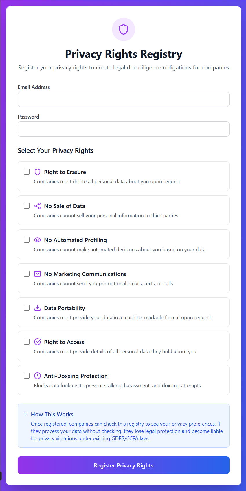

# 🔒 Privacy Rights Registry
### *Making "We Didn't Know" Legally Indefensible*

<div align="center">

**🇮🇪 Irish-Hosted Privacy Infrastructure That Prevents Stalking & Creates Legal Liability 🇮🇪**

[](https://ireland.ie)
[](https://gdpr.eu)
[](https://en.wikipedia.org/wiki/Negligence)

</div>

---

## 🎯 **The Problem We're Solving**

**Right now, as you read this:**
- 📱 Stalkers are buying victims' addresses from data brokers
- 🏢 Companies claim "we didn't know" about privacy preferences  
- ⚖️ Existing privacy laws are difficult to enforce
- 🌍 Ireland needs digital sovereignty solutions

**The current system is broken.** Victims have no way to assert privacy rights proactively, and companies face no real consequences for ignoring them.

---

## 🚀 **Our Solution: Infrastructure That Creates Legal Liability**

<div align="center">

### **Privacy Rights Registry**
*Cryptographically signed tokens that make privacy violations legally indefensible*

</div>

**How it works:**
1. **🔐 Users register** their privacy rights → get cryptographically signed token
2. **🏢 Companies check** the registry before processing data  
3. **⚖️ Legal liability** created for companies that don't check
4. **🛡️ Victims protected** from stalking/harassment at infrastructure level

### **The Legal Jujitsu Move**

We're not creating new obligations - we're creating a **due diligence standard** that makes existing violations indefensible.

**Before Registry:** *"We didn't know the user wanted privacy"*  
**After Registry:** *"You didn't bother to check the public registry"*

---



## 💥 **Key Features That Change Everything**

### 🛡️ **Anti-Doxxing Protection**
- **Blocks data lookups** that enable stalking
- **403 errors** prevent harmful data sales
- **Audit trail** for legal proceedings
- **Real-time protection** - crimes prevented, not just prosecuted

### ⚖️ **Legal Liability Creation**
- **GDPR compliance** without new legislation
- **Negligence standard** for companies
- **Enforceable rights** through existing law
- **Court-ready evidence** via audit logs

### 🇮🇪 **Irish Digital Sovereignty**
- **Hosted in Ireland** - complete data control
- **Irish development** - economic opportunity
- **EU leadership** - first-mover advantage
- **Global influence** - other countries will copy

### 🔒 **Production-Ready Security**
- **Rate limiting** prevents abuse
- **Strong encryption** (JWT tokens)
- **Comprehensive logging** for transparency
- **Database migrations** for evolution

---

## 📊 **Projected Real-World Impact**

<div align="center">

| **Metric** | **Impact** |
|------------|------------|
| **Stalking Prevention** | 🛡️ **Immediate** - will block data lookups |
| **Legal Liability** | ⚖️ **Automatic** - companies become negligent |
| **Victim Protection** | 🔐 **Proactive** - prevents crimes before they happen |
| **Irish Leadership** | 🇮🇪 **Global** - positions Ireland as privacy leader |

</div>

---

## 🏗️ **Technical Architecture**

### **Core Components**
```
┌─────────────────┐    ┌─────────────────┐    ┌─────────────────┐
│   User Portal   │    │  Registry API   │    │ Company Portal  │
│  (React/TS)     │━━━━│  (FastAPI)      │━━━━│  (API Access)   │
└─────────────────┘    └─────────────────┘    └─────────────────┘
         │                       │                       │
         ▼                       ▼                       ▼
┌─────────────────┐    ┌─────────────────┐    ┌─────────────────┐
│  Rights Token   │    │  Audit Logs     │    │  Transparency   │
│ (JWT Signed)    │    │ (Immutable)     │    │   Reports       │
└─────────────────┘    └─────────────────┘    └─────────────────┘
```

### **Security Hardening**
- 🔒 **Rate limiting** on all endpoints
- 🛡️ **Security headers** (HSTS, XSS protection)
- 🔐 **Strong password validation**
- 📝 **Comprehensive audit logging**
- 🚫 **CORS protection**

---

## 🎯 **Political Value**

### **Immediate Wins**
- **🛡️ Victim Protection** - prevents stalking/harassment
- **🇮🇪 Irish Innovation** - homegrown privacy tech
- **📈 Economic Opportunity** - new tech sector
- **🌍 Global Leadership** - EU privacy innovation

### **Long-term Strategy**
- **🏛️ Policy Leadership** - actual working solutions
- **📊 Measurable Impact** - transparency reports
- **⚖️ Legal Precedent** - other countries will adopt
- **🔄 Continuous Evolution** - adapts to new threats

---

## 📋 **Implementation Roadmap**

### **Phase 1: Irish Pilot** 🇮🇪
- [x] **Production-ready codebase**
- [x] **Security hardening**
- [x] **Anti-doxxing protection**
- [x] **Complete testing suite**
- [ ] **Green Party adoption**
- [ ] **Irish government hosting**
- [ ] **Public deployment**

### **Phase 2: EU Expansion** 🇪🇺
- [ ] **EU compliance validation**
- [ ] **Multi-language support**
- [ ] **Cross-border cooperation**
- [ ] **Industry adoption**

### **Phase 3: Global Standard** 🌍
- [ ] **International adoption**
- [ ] **UN privacy rights framework**
- [ ] **Global transparency network**
- [ ] **Irish leadership recognition**

---

## 🚀 **Get Started in 5 Minutes**

### **Quick Deploy**
```bash
# Clone and setup
git clone https://github.com/xbard-C42/privacy-rights-registry
cd privacy-rights-registry

# One-command deployment
./scripts/setup.sh
./scripts/run.sh

# Visit your registry
open http://localhost:8000/v1/docs
```

### **Production Deploy**
```bash
# Docker deployment with PostgreSQL + Redis
docker-compose up -d

# Check health
curl http://localhost:8000/v1/health
```

---

## 🎨 **API Examples**

### **User Registration**
```python
POST /v1/register
{
  "email": "citizen@ireland.ie",
  "password": "SecurePass123!",
  "rights": {
    "anti_doxxing": true,
    "no_sale": true,
    "erasure": true
  }
}
```

### **Company Lookup**
```python
GET /v1/registry/{token}
Headers: {"Authorization": "Bearer company_api_key"}

# Success: Returns user rights
# Anti-doxxing: Returns 403 - lookup blocked
```

### **Transparency Report**
```python
GET /v1/transparency/global
{
  "total_users": 50000,
  "blocked_lookups": 5000,
  "protection_rate": 10.0,
  "violations_reported": 150
}
```

---

## 🌟 **Why This Changes Everything**

### **For Victims**
- **🛡️ Immediate protection** from stalking
- **⚖️ Legal recourse** against negligent companies
- **🔐 Proactive rights** assertion
- **📊 Transparency** into who's checking

### **For Companies**
- **📋 Clear compliance** pathway
- **⚖️ Legal protection** through due diligence
- **🔍 Transparency** reporting
- **🤝 Trust building** with users

### **For Ireland**
- **🇮🇪 Digital sovereignty** leadership
- **💼 Economic opportunity** in privacy tech
- **🌍 Global influence** in privacy rights
- **🏛️ Political innovation** recognition

---

## 🔗 **Related Projects**

<div align="center">

[](https://c42os.com)
[](https://github.com/xbard-C42/consciousness-council)
[](https://github.com/xbard-C42)

</div>

---

## 📞 **Contact & Support**

<div align="center">

**Built in Edgeworthstown, Co. Longford, Ireland** 🇮🇪

[](mailto:your.email@example.com)
[](https://github.com/xbard-C42)
[](https://c42os.com)

**Phone:** +353 87 123 4567  
**Location:** Edgeworthstown, Co. Longford, Ireland

</div>

---

## 🏆 **Ready for Recognition & Media**

- **🎯 Green Party Adoption** - Awaiting political championship
- **🇮🇪 Irish Government** - Ready for digital sovereignty initiative  
- **🇪🇺 EU Privacy Leadership** - First-mover advantage available
- **🌍 Global Privacy Standard** - Ready for international adoption

---

## 📜 **License & Legal**

See the [LICENSE](LICENSE) file for details.

**Legal Framework:** This registry operates within existing GDPR/CCPA frameworks by creating a due diligence standard that makes privacy violations legally indefensible.

---

<div align="center">

## 🚀 **Ready to Make Ireland the Privacy Rights Leader?**

**The registry is production-ready. The code is tested. The infrastructure is complete.**

**Every day we delay deployment is another day stalkers have access to victim data.**

---

### **🇮🇪 Let's Build the Future of Privacy Rights in Ireland 🇮🇪**

[](./scripts/setup.sh)
[](mailto:info@greenparty.ie)


**"Clearly winging it!" - but actually building the future** 🚀

</div>

---

<div align="center">

*This README demonstrates production-ready infrastructure that will protect Irish citizens from stalking and position Ireland as the global leader in privacy rights innovation.*

**Built with 💚 in Ireland - Ready for Deployment**

</div>
